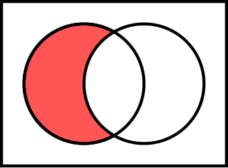

### Challenge 1: Credit Card Mask

- **Link:** https://www.codewars.com/kata/5412509bd436bd33920011bc
- **Description:**
Usually when you buy something, you're asked whether your credit card number, phone number or answer to your most secret question is still correct. However, since someone could look over your shoulder, you don't want that shown on your screen. Instead, we mask it.

Your task is to write a function maskify, which changes all but the last four characters into '#'.
- **My Solution:**
  // return masked string
function maskify(cc) {
if (cc.length <= 4) {
        return cc; // Return the original string if it's short
    }
    // Mask all but the last four characters
    return '#'.repeat(cc.length - 4) + cc.slice(-4);
}
### Challenge 2: Playing with Sets : Complement

- **Link:** https://www.codewars.com/kata/5884e9ccf72916207900010f
- **Description:**
Set objects are new JavaScript built-in objects defined since ECMAScript 2015

A Set lets you store unique values of any type. It comes with some useful methods like .add, .clear, .has . . . BUT some "Set operations" are missing, like . . .

Complement

Two sets can be "subtracted". The relative complement of B in A, denoted by A \ B (or A − B), is the set of all elements that are members of A but not members of B. Note that it is valid to "subtract" members of a set that are not in the set, such as removing the element green from the set {1, 2, 3}; doing so has no effect.
- **My Solution:**
  function diff(s1, s2) {
    const result = new Set();
    for (let item of s1) {
        if (!s2.has(item)) {
            result.add(item);
        }
    }
    return result;
}
### Challenge 3: Powers of 3

- **Link:** https://www.codewars.com/kata/57be674b93687de78c0001d9
- **Description:** 
Given a positive integer N, return the largest integer k such that 3^k < N.

For example,

3 --> 0
4 --> 1
You may assume that the input to your function is always a positive integer.

- **My Solution:**
function largestPower(n){
  let k = 0;

while(Math.pow(3,k) < n){k++}
return k-1;
}
  ### Challenge 4: Coding 3min: Bug in Apple

- **Link:** https://www.codewars.com/kata/56fe97b3cc08ca00e4000dc9
- **Description:** This is the simple version of Shortest Code series. If you need some challenges, please try the challenge version.

Task:
Find out "B"(Bug) in a lot of "A"(Apple).

There will always be one bug in apple, not need to consider the situation that without bug or more than one bugs.

input: string Array apple

output: Location of "B", [x,y]

Series:
Bug in Apple
Father and Son
Jumping Dutch act
Planting Trees
Give me the equation
Find the murderer
Reading a Book
Eat watermelon
Special factor
Guess the Hat
Symmetric Sort
Are they symmetrical?
Max Value
Trypophobia
Virus in Apple
Balance Attraction
Remove screws I
Remove screws II
Regular expression compression
Collatz Array(Split or merge)
Tidy up the room
Waiting for a Bus
- **My Solution:**
  function sc(apple){
  for(let x= 0;x<apple.length;x++){
    const y = apple[x].indexOf('B');
    if(y!==-1){
      return [x,y]
    }
  }
  return null;
}
  ### Challenge 5: FIXME: Hello

- **Link:** https://www.codewars.com/kata/5b0a80ce84a30f4762000069
- **Description:** 
The code provided has a method hello which is supposed to show only those attributes which have been explicitly set. Furthermore, it is supposed to say them in the same order they were set.

But it's not working properly.

Notes
There are 3 attributes

name
age
sex ('M' or 'F')
When the same attribute is assigned multiple times the hello method shows it only once. If this happens the order depends on the first assignment of that attribute, but the value is from the last assignment.

Examples
Hello.
Hello. My name is Bob. I am 27. I am male.
Hello. I am 27. I am male. My name is Bob.
Hello. My name is Alice. I am female.
Hello. My name is Batman.
Task
Fix the code so we can all go home early.
- **My Solution:**
  class Dinglemouse {
    constructor() {
        this.attributes = {};
        this.order = [];
    }

    setAge(age) {
        this.attributes.age = age;
        this.addToOrder('age');
        return this;
    }

    setSex(sex) {
        this.attributes.sex = sex;
        this.addToOrder('sex');
        return this;
    }

    setName(name) {
        this.attributes.name = name;
        this.addToOrder('name');
        return this;
    }

    addToOrder(attr) {
        if (!this.order.includes(attr)) {
            this.order.push(attr);
        }
    }

    hello() {
        const greetings = ['Hello.'];
        this.order.forEach(attr => {
            if (attr === 'name') {
                greetings.push(`My name is ${this.attributes.name}.`);
            } else if (attr === 'age') {
                greetings.push(`I am ${this.attributes.age}.`);
            } else if (attr === 'sex') {
                greetings.push(`I am ${this.attributes.sex === 'M' ? "male" : "female"}.`);
            }
        });
        return greetings.join(' ');
    }
}
